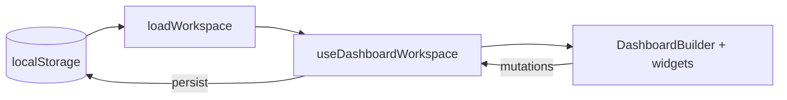

# Dashboard Builder

A React + TypeScript dashboard assignment: draggable and resizable widgets (To‑Do, Weather, Chart, Notes), multi-tab workspace, light/dark theme, undo/redo, JSON import/export, and persistence in the browser via `localStorage`.

Repository: [github.com/ItsImran10140/Dashboard-Builder](https://github.com/ItsImran10140/Dashboard-Builder)

---

## 2. Architecture

### Overview

The app is a single-page UI. All product logic for workspaces, tabs, widgets, undo, and import/export lives in **`useDashboardWorkspace`** (`src/hooks/useDashboardWorkspace.ts`). The shell component **`DashboardBuilder`** (`src/components/DashboardBuilder/DashboardBuilder.tsx`) wires that hook to the grid, toolbar, marketplace modal, and widget panels.

Persistence is a thin layer in **`src/lib/workspaceStorage.ts`** (read/write `localStorage`, migrate legacy v1 key to v2). Types are split between **`src/types/dashboard.ts`** (widgets, layouts, per-tab state) and **`src/types/workspace.ts`** (full workspace file, export shapes).

### Tech stack

| Layer | Technology |
|--------|------------|
| UI | React 19, TypeScript |
| Build | Vite 8 |
| Grid | `react-grid-layout` (responsive layout, drag/resize) |
| Charts | Chart.js, `react-chartjs-2` |
| Styling | CSS variables in `src/styles/index.css`, CSS Modules under `DashboardBuilder` |
| Data / “API” | `src/api/mockApi.ts` (delayed promises, no backend) |

### Entry flow

1. **`src/main.tsx`** — mounts the app, loads global styles.
2. **`src/App.tsx`** — renders `DashboardBuilder` inside a styled `<main>`.
3. **`DashboardBuilder`** — subscribes to the workspace hook, renders `Responsive` grid, maps `state.widgets` to widget components, handles file import and keyboard shortcuts.

### State and persistence

- **Canonical model**: `WorkspaceFileV2` — `version`, `theme`, `activeDashboardId`, `dashboards[]`. Each dashboard tab is a `DashboardTab` (`id`, `name`, `widgets`, `layouts`).
- **Single write path**: `persist()` updates `workspaceRef`, calls `saveWorkspace()` (stringify to `localStorage`), then `setWorkspace`.
- **Active tab slice**: `state` is a `useMemo` of the active tab’s `widgets` + `layouts` so the grid always matches the selected tab.
- **Theme**: `workspace.theme` is applied to `document.documentElement.dataset.theme` for CSS variable themes.

### Undo / redo

Undo stacks are **per tab id**, stored in a **`ref`** (not persisted). Drag/resize starts a group with **`beginLayoutUndoGroup`**; ongoing moves use **`applyLayoutsSilent`** so each pixel does not create a new undo step. Other mutations use **`commitDashboardState`**.

### Import / export

Implemented in the same hook: full workspace JSON, single-dashboard export (`exportKind: 'single-dashboard'`), merge import, replace import, and legacy `{ widgets, layouts }` wrapped as a new tab.

### Folder map

```
src/
  main.tsx, App.tsx
  api/mockApi.ts
  hooks/useDashboardWorkspace.ts
  lib/workspaceStorage.ts, dashboardInitialState.ts, dashboardClone.ts
  types/dashboard.ts, workspace.ts
  utils/createId.ts
  components/DashboardBuilder/
    DashboardBuilder.tsx, DashboardBuilder.module.css
    MarketplaceModal.tsx
    widgets/   # Todo, Weather, Chart, Notes, WidgetSettingsPanel
  styles/index.css, App.module.css
```

### Data flow (high level)



---

## 3. Instructions to run the project

### Requirements

- **Node.js** 20 or newer (LTS recommended)
- **npm** (bundled with Node)

### Install

```bash
cd Frontend_Assignment
npm install
```

Reproducible install (uses `package-lock.json`):

```bash
npm ci
```

### Development

```bash
npm run dev
```

Open the URL Vite prints (typically **http://localhost:5173**). Edit files under `src/`; the dev server hot-reloads.

### Production build

```bash
npm run build
```

Runs the TypeScript project build, then Vite. Output is written to **`dist/`**.

### Preview production build locally

```bash
npm run preview
```

Serves **`dist/`** for a quick check before deploy.

### Lint

```bash
npm run lint
```

---

## Scripts reference

| Command | Description |
|---------|-------------|
| `npm run dev` | Start Vite dev server |
| `npm run build` | `tsc -b` + Vite production build |
| `npm run preview` | Preview `dist/` |
| `npm run lint` | Run ESLint |
